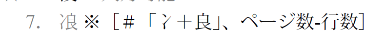

# AozoraGaijiChukiXml
[青空文庫・外字注記辞書【第八版】](https://www.aozora.gr.jp/gaiji_chuki/)のXML形式です。
PDFから独自に定義したXML形式に変換したものです。

## ファイル
| パス | 説明 |
| -- | -- |
| [data/Chuki.xml](data/Chuki.xml) | XMLファイル本体 |
| [data/Chuki.xsd](data/Chuki.xsd) | XML Schemaファイル |
| [doc/original](doc/original) | 変換元ファイル |
| [GaijiChukiConvert](GaijiChukiConvert) | 変換用ツール (C#) |

### XML Schemaについて
プログラミング言語によっては、XML Schemaからソースコードを作成できる場合があります。

Visual Studioの場合、`xsd.exe`でC#ソースコードが出力されます。
デシリアライズすることでインスタンスとして扱えるので便利です。

```
$ cd GaijiChukiConvert\Schemas
$ xsd.exe /parameters:xsdParam.xml
```

## 注意点
いくつか不正確な点があるのであくまで参考として扱ってください。

### 省略
一部の内容はXMLでは表現されていません。以下は一例で全てではありません。

* 「外字注記辞書の使い方」 (p1)
* 「アクセント付きラテン文字（アクセント分解）」 (p202)
* 「改訂内容」 (p215)
* 各種注意書き

### 色情報
PDF上で色で表現されている内容はXMLには反映されていません。

### 非対応文字
PDFをUnicodeテキストファイル形式で変換したものを元にしている為、いくつかの文字が正しく示されていません。
特に外字である`<characters>`内には注意が適切でない場合があります。

多数が該当するため修正していません。

#### 例1: 組み合わせ
PDF作成時に複数文字の組み合わせで表現した文字があるようです。

以下に例示します。他にも「その他」-「屋号」(200ページ)などは多くが該当します。



> 7．冫良※［＃「冫＋良」、ページ数-行数］

```xml
        <entry docPage="19" strokes="7">
          <characters>
            <character>冫</character>
            <character>良</character>
          </characters>
          <note>
            <full>「冫＋良」、ページ数-行数</full>
            <description>「冫＋良」</description>
          </note>
        </entry>
```

#### 例2: 空白
最新版Adobe Acrobatで閲覧して空白に見える文字では`<characters>`内が空白になります。
該当する文字は多数あります。

#### 例3: 文字違い
全く異なる文字に変換される例があります。

以下に例示します。


> ø 　※［＃下書きのι付きα、U+1FB3、ページ数-行数］

#### 例4: 字形
PDF上でフォントの指定などで表現されている字形の違いが、XML上では同一の文字として表現されています。

### その他
その他バグや不完全な部分が存在するかもしれません。
参考程度と考えてください。

## 作成手順
1. PDFファイルをAdobe Readerで開き、「ファイル (F)」→「テキストとして保存 (V)」
2. テキストファイルの編集 (最低限)。
3. [GaijiChukiConvert](GaijiChukiConvert)で変換。

テキストファイルの編集は以下程度です([差分](doc/original/gaiji_chuki.diff.txt))。

* `※［＃...］`注釈を含む例示。
  * 削除しないと変換プログラムが複雑になるため。
* 「屋号」のテキストファイル変換が破綻していたので修正。
* 「丸付き片仮名」に改行挿入。
  * こちらは変換プログラムで対処するのが面倒だったため。
  * 今後の改訂を考えれば望ましくない。

## GaijiChukiConvertの使い方
```
$ GaijiChukiConvert gaiji_chuki.txt out.xml
```

第1引数に変換元ファイル(普通はgaiji_chuki.txt)、第2引数に返還後のファイル名を指定してください。

デバッグビルドで実行する場合は[Program.cs](GaijiChukiConvert/GaijiChukiConvert/Program.cs)を適宜編集してください。

# ライセンス
CC0 1.0

元PDFのライセンスは以下の通りです。変換結果もこれに準じます。
CC0での加工・配布も自由だと考えています。

> ◎ この資料は自由に使ってください。加工・再配布に際しても編集者への連絡は必要ありません。  
> ◎ 作業には細心の配慮をおこないましたが、利用により生じた結果は責任をおいかねますことをご了承ください。  
> 
